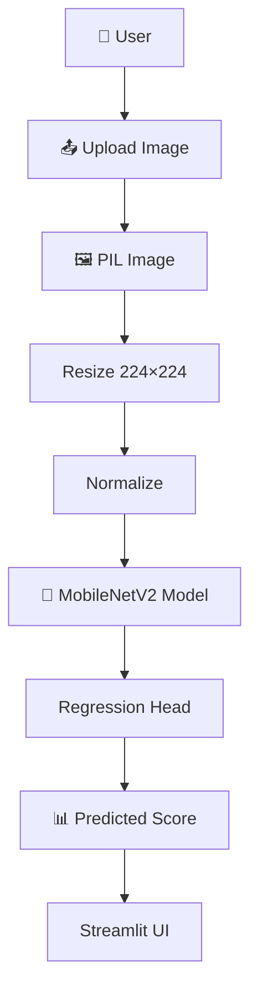
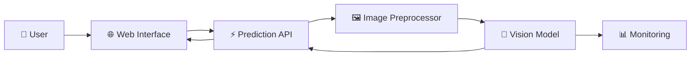

# 👤 Facial Beauty Score Prediction

<p align="center">

  
  
  
  
  
  

</p>

<h3 align="center">

🧠 Deep Learning for Facial Beauty Score Estimation

</h3>

<p align="center">

A computer-vision regression system using <strong>MobileNetV2 transfer learning</strong> to estimate the facial beauty score associated with images in the SCUT-FBP5500 dataset.

</p>

<p align="center">

<strong>Image → Feature Extraction → Regression → Beauty Score</strong>

</p>

---

# 🚀 Project Overview

This project investigates how a pretrained convolutional neural network can be adapted for **continuous facial-score prediction**.

Instead of treating the task as a classification problem, the system formulates it as **regression**, where the model predicts a continuous score corresponding to the annotation provided in the dataset.

The complete workflow is:

```text
                  ┌──────────────────────┐
                  │  SCUT-FBP5500        │
                  │  5,500 Facial Images │
                  └──────────┬───────────┘
                             │
                             ▼
                  ┌──────────────────────┐
                  │ Data Preparation     │
                  │ + Train/Val/Test     │
                  └──────────┬───────────┘
                             │
                             ▼
                  ┌──────────────────────┐
                  │ Image Augmentation   │
                  │ 224 × 224 RGB        │
                  └──────────┬───────────┘
                             │
                             ▼
                  ┌──────────────────────┐
                  │    MobileNetV2       │
                  │ ImageNet Pretrained  │
                  └──────────┬───────────┘
                             │
                             ▼
                  ┌──────────────────────┐
                  │ Global Average Pool  │
                  └──────────┬───────────┘
                             │
                             ▼
                  ┌──────────────────────┐
                  │ Dense 128 + ReLU     │
                  │ Dropout 0.5          │
                  └──────────┬───────────┘
                             │
                             ▼
                  ┌──────────────────────┐
                  │ Linear Regression    │
                  │ Output: 1 Score      │
                  └──────────┬───────────┘
                             │
                             ▼
                     Predicted Score
```

---

# 🎯 Problem Formulation

The task is formulated as a **supervised image regression problem**.

Given a facial image:

```text
X = Facial Image
```

the model learns a mapping:

```text
f(X) → y
```

where:

* `X` = input facial image
* `f` = trained deep-learning model
* `y` = continuous dataset-associated beauty score

The model therefore does not simply output a category such as *high* or *low*.

Instead, it produces a continuous numerical prediction.

---

# 📊 Dataset

The project uses the **SCUT-FBP5500 facial beauty scores dataset**, downloaded through KaggleHub.

### Dataset Statistics

| Property          |          Value |
| ----------------- | -------------: |
| Total Images      |      **5,500** |
| Training Images   |      **3,850** |
| Validation Images |        **825** |
| Test Images       |        **825** |
| Image Size        |  **224 × 224** |
| Channels          |        **RGB** |
| Task              | **Regression** |

The notebook reads the dataset's `labels.txt`, containing image filenames and corresponding beauty scores.

Example:

```text
image_name     beauty_score
────────────────────────────
CF437.jpg      2.883333
AM1384.jpg     2.466667
AM1234.jpg     2.150000
AM1774.jpg     3.750000
AM215.jpg      ...
```

---

# 🧩 Dataset Split

The dataset is divided into three independent subsets:

```text
                         5,500 Images
                              │
                 ┌────────────┼────────────┐
                 │            │            │
                 ▼            ▼            ▼
              TRAIN          VAL          TEST
               70%            15%          15%
                 │            │            │
                 ▼            ▼            ▼
             3,850          825          825
```

The split uses a fixed random seed:

```python
random_state = 42
```

This improves reproducibility of the experiment.

---

# 🖼️ Image Processing Pipeline

Every image is resized to:

```text
224 × 224 × 3
```

Pixel values are normalized to:

```text
[0, 1]
```

using:

```python
rescale = 1./255
```

### Training Augmentation

The training pipeline applies:

```text
Random Rotation       ±20°
Width Shift           20%
Height Shift          20%
Shear                 20%
Zoom                  20%
Horizontal Flip       Enabled
Fill Mode             Nearest
```

This introduces controlled variation during training and helps the model become less dependent on the exact appearance of individual training images.

---

# 🔄 Computer Vision Pipeline

```mermaid
flowchart LR

    A["🖼️ Input Image"] --> B["Resize 224×224"]
    B --> C["Normalize Pixels"]
    C --> D["Data Augmentation"]

    D --> E["MobileNetV2"]
    E --> F["Feature Maps"]

    F --> G["Global Average Pooling"]
    G --> H["Dense 128 + ReLU"]
    H --> I["Dropout 0.5"]
    I --> J["Dense 1 + Linear"]

    J --> K["📊 Predicted Score"]
```



---

# 🧠 Transfer Learning Architecture

The core of the project is **MobileNetV2 pretrained on ImageNet**.

Instead of training an entire CNN from scratch, the pretrained convolutional backbone is reused as a visual feature extractor.

```text
                       INPUT IMAGE
                           │
                           ▼
                ┌─────────────────────┐
                │     MobileNetV2     │
                │  ImageNet Weights   │
                └──────────┬──────────┘
                           │
                           ▼
                ┌─────────────────────┐
                │ Feature Extraction  │
                │       Layers        │
                └──────────┬──────────┘
                           │
                           ▼
                ┌─────────────────────┐
                │ Global Average Pool │
                └──────────┬──────────┘
                           │
                           ▼
                ┌─────────────────────┐
                │ Dense               │
                │ 128 / ReLU          │
                └──────────┬──────────┘
                           │
                           ▼
                ┌─────────────────────┐
                │ Dropout             │
                │ 50%                 │
                └──────────┬──────────┘
                           │
                           ▼
                ┌─────────────────────┐
                │ Output              │
                │ 1 / Linear          │
                └──────────┬──────────┘
                           │
                           ▼
                    BEAUTY SCORE
```

---

# 🏗️ Model Architecture

The implementation uses:

```python
MobileNetV2(
    weights="imagenet",
    include_top=False,
    input_shape=(224, 224, 3)
)
```

The pretrained layers are frozen during the initial training stage.

A custom regression head is then added:

```python
GlobalAveragePooling2D()
Dense(128, activation="relu")
Dropout(0.5)
Dense(1, activation="linear")
```

### Architecture Summary

| Component          | Configuration           |
| ------------------ | ----------------------- |
| Backbone           | **MobileNetV2**         |
| Pretrained Weights | **ImageNet**            |
| Input              | **224 × 224 × 3**       |
| Backbone           | Frozen                  |
| Pooling            | Global Average Pooling  |
| Dense Layer        | **128 neurons**         |
| Activation         | **ReLU**                |
| Dropout            | **0.5**                 |
| Output             | **1 neuron**            |
| Output Activation  | **Linear**              |
| Task               | **Regression**          |
| Optimizer          | **Adam**                |
| Learning Rate      | **0.001**               |
| Loss               | **Mean Squared Error**  |
| Metric             | **Mean Absolute Error** |

---

# 📐 Why Regression?

The target is a continuous numerical score rather than a fixed class.

Therefore:

```text
Classification
────────────────────────────
Input → Class
       ↓
High / Medium / Low


Regression
────────────────────────────
Input → Continuous Value
       ↓
      3.42
```

A linear output neuron is therefore used:

```python
Dense(1, activation="linear")
```

This allows the network to produce a continuous prediction.

---

# 📉 Loss Function

The model uses **Mean Squared Error (MSE)** as the training objective.

```text
              Prediction
                  │
                  ▼
            ┌───────────┐
            │   MSE     │
            └─────┬─────┘
                  │
                  ▼
          Parameter Updates
                  │
                  ▼
             Better Model
```

The evaluation metric is **Mean Absolute Error (MAE)**.

MAE provides an intuitive interpretation of the average absolute difference between the predicted score and the annotated score.

---

# 🛡️ Regularization

The custom regression head includes:

```python
Dropout(0.5)
```

The dropout layer randomly deactivates a portion of neurons during training.

Conceptually:

```text
Dense 128
    │
    ▼
████████████████
██  ██    █████
  ██    ██
████  ████████
    │
    ▼
Dropout 50%
    │
    ▼
Linear Output
```

This is intended to reduce over-reliance on individual features and improve generalization.

---

# 🧪 Training Strategy

The notebook uses two callbacks:

### ModelCheckpoint

The best model is saved according to validation MAE:

```python
monitor="val_mae"
mode="min"
save_best_only=True
```

### EarlyStopping

Training can stop when validation MAE stops improving:

```python
monitor="val_mae"
patience=10
restore_best_weights=True
```

This creates the following training strategy:

```text
                TRAINING
                    │
                    ▼
             Monitor val_MAE
                    │
          ┌─────────┴─────────┐
          │                   │
       Improves           No Improvement
          │                   │
          ▼                   ▼
    Save Best Model      Count Patience
                              │
                              ▼
                       Early Stopping
```

---

# 📈 Experimental Results

The recorded experiment was trained for **1 epoch** in the notebook.

### Training

| Metric          |     Result |
| --------------- | ---------: |
| Training Loss   | **0.6681** |
| Training MAE    | **0.6466** |
| Validation Loss | **0.2595** |
| Validation MAE  | **0.4022** |

### Test Evaluation

| Metric   |     Result |
| -------- | ---------: |
| Test MSE | **0.2810** |
| Test MAE | **0.4077** |

### Performance Snapshot

```text
                    TEST MAE

                    0.4077

        ┌─────────────────────────┐
        │                         │
        │       ███████████       │
        │       █  0.4077 █       │
        │       ███████████       │
        │                         │
        └─────────────────────────┘
```

> **Interpretation:** The recorded test MAE is approximately `0.41` score units on the dataset's scoring scale. Since the notebook only trains for one epoch, this should be considered a baseline experiment rather than a fully optimized model.

---

# 📊 Training Visualization

The notebook generates two training-history visualizations:

### Mean Absolute Error

```text
MAE
 │
 │\
 │ \
 │  \
 │   ─────────
 │
 └────────────────── Epoch
```

### Loss

```text
Loss
 │\
 │ \
 │  \
 │   ─────────
 │
 └────────────────── Epoch
```

For the polished GitHub repository, these plots should be exported into:

```text
assets/
├── training-mae.png
└── training-loss.png
```

and displayed directly in the README.

---

# 🖥️ Streamlit Application

The trained model is integrated into a Streamlit interface called:

> **Facial Beauty Score Predictor**

The application allows a user to upload:

```text
.jpg
.jpeg
.png
```

The uploaded image is processed and passed through the saved MobileNetV2-based model.



---

# 🌐 Application Architecture

```text
                         STREAMLIT
                             │
                             ▼
                    ┌─────────────────┐
                    │  Upload Image   │
                    └────────┬────────┘
                             │
                             ▼
                    ┌─────────────────┐
                    │ Image Processing│
                    │   224 × 224     │
                    └────────┬────────┘
                             │
                             ▼
                    ┌─────────────────┐
                    │   MobileNetV2   │
                    │ Feature Extract │
                    └────────┬────────┘
                             │
                             ▼
                    ┌─────────────────┐
                    │ Regression Head │
                    └────────┬────────┘
                             │
                             ▼
                    ┌─────────────────┐
                    │ Predicted Score │
                    └─────────────────┘
```

---

# 💾 Model Artifact

The best validation checkpoint is saved as:

```text
best_beauty_predictor_model.keras
```

This allows the trained model to be loaded directly by the Streamlit application without retraining.

```python
model = tf.keras.models.load_model(
    "best_beauty_predictor_model.keras"
)
```

---

# 🛠️ Technology Stack

| Technology          | Role                      |
| ------------------- | ------------------------- |
| 🐍 **Python**       | Core development          |
| 🧠 **TensorFlow**   | Deep learning framework   |
| ⚡ **Keras**         | Model construction        |
| 👁️ **MobileNetV2** | Visual feature extraction |
| 📊 **Pandas**       | Dataset management        |
| 🔢 **NumPy**        | Numerical processing      |
| 🖼️ **Pillow**      | Image processing          |
| 📈 **Matplotlib**   | Training visualization    |
| 🌐 **Streamlit**    | Application deployment    |
| ☁️ **KaggleHub**    | Dataset acquisition       |

---

# 📁 Repository Structure

```text
facial-beauty-score-prediction/
│
├── 📓 Facial_Beauty_Rating.ipynb
│
├── 🖥️ app.py
│
├── 🧠 best_beauty_predictor_model.keras
│
├── 🖼️ assets/
│   ├── dataset-samples.png
│   ├── model-architecture.png
│   ├── training-mae.png
│   ├── training-loss.png
│   └── application.png
│
├── 📦 requirements.txt
│
├── 🚫 .gitignore
│
└── 📖 README.md
```

---

# ⚙️ Installation

Clone the repository:

```bash
git clone https://github.com/YOUR_USERNAME/facial-beauty-score-prediction.git
cd facial-beauty-score-prediction
```

Create a virtual environment:

```bash
python -m venv venv
```

### Windows

```bash
venv\Scripts\activate
```

### Linux / macOS

```bash
source venv/bin/activate
```

Install dependencies:

```bash
pip install tensorflow pandas numpy pillow matplotlib streamlit kagglehub
```

---

# ▶️ Run the Application

Once the trained model is available:

```bash
streamlit run app.py
```

The Streamlit interface will launch in the browser.

---

# 🔬 Reproduce the Experiment

Open:

```text
Facial_Beauty_Rating.ipynb
```

The notebook contains the complete workflow:

```text
Dataset Download
      ↓
Label Loading
      ↓
Image Path Construction
      ↓
Train / Validation / Test Split
      ↓
Image Generators
      ↓
Data Augmentation
      ↓
MobileNetV2
      ↓
Regression Head
      ↓
Training
      ↓
Evaluation
      ↓
Visualization
      ↓
Streamlit Application
```

---

# ⚠️ Responsible AI & Limitations

This section is particularly important for this project.

The predicted score represents a **dataset-associated annotation**, not an objective measurement of human attractiveness or worth.

Human perceptions of facial appearance are subjective and can vary substantially across:

* Individuals
* Cultures
* Demographics
* Age groups
* Social contexts
* Annotation methodologies

A model trained on a particular dataset can reproduce patterns and biases present in that dataset.

### Therefore, this model should not be used for:

* Employment decisions
* Education decisions
* Insurance decisions
* Credit decisions
* Identity assessment
* Social ranking
* High-stakes profiling
* Automated judgments about a person's value or worth

The project is intended primarily as an **educational computer-vision and transfer-learning experiment**.

---

# 🧪 Current Model Limitations

### 01 — Limited Training Duration

The recorded experiment uses only **one training epoch**.

```text
Epochs = 1
```

Therefore, the current model should be treated as a baseline.

### 02 — Frozen Backbone

The MobileNetV2 feature extractor is frozen during the experiment.

A future fine-tuning stage could potentially improve performance.

### 03 — Dataset Dependence

Predictions depend heavily on the SCUT-FBP5500 annotations and distribution.

### 04 — Subjectivity

The target itself represents human-provided ratings and therefore cannot be interpreted as an objective ground truth about beauty.

### 05 — Generalization

Performance on images outside the dataset distribution is not established by this experiment.

---

# 🚀 Future Development

## Phase I — Model Optimization

```text
Current
MobileNetV2
    │
    ▼
Frozen Backbone
    │
    ▼
Regression Head

Future
    │
    ▼
Partial Unfreezing
    │
    ▼
Fine-Tuning
    │
    ▼
Better Representation
```

Planned:

* [ ] Train for additional epochs
* [ ] Fine-tune upper MobileNetV2 layers
* [ ] Learning-rate scheduling
* [ ] Hyperparameter optimization
* [ ] Compare different backbones
* [ ] Cross-validation

---

# 🧠 Phase II — Model Comparison

Evaluate multiple pretrained architectures:

```text
                    IMAGE
                      │
        ┌─────────────┼─────────────┐
        ▼             ▼             ▼
   MobileNetV2     EfficientNet    ResNet
        │             │             │
        └─────────────┼─────────────┘
                      ▼
                Regression Head
                      │
                      ▼
                  Comparison
```

Potential candidates:

* MobileNetV2
* EfficientNet
* ResNet50
* DenseNet
* ConvNeXt
* Vision Transformer

---

# 🔍 Phase III — Explainable Computer Vision

A future version could include visual explanation techniques such as:

```text
                 Input Image
                      │
                      ▼
               Trained Model
                      │
                      ▼
              Feature Importance
                      │
                      ▼
              Visual Explanation
```

Potential techniques:

* Grad-CAM
* Integrated Gradients
* Occlusion analysis
* Feature visualization

The goal would be to investigate **which visual regions influence the model's prediction**, rather than presenting a score without context.

---

# 🌐 Phase IV — Production Architecture

A production-oriented version could evolve into:



Potential technologies:

* FastAPI
* Docker
* Cloud deployment
* Model versioning
* API monitoring
* Automated CI/CD

---

# 📌 Project Status

<p align="center">

**🟢 BASELINE MODEL COMPLETED**

</p>

| Component                     | Status    |
| ----------------------------- | --------- |
| Dataset Acquisition           | ✅         |
| Data Preparation              | ✅         |
| Train/Validation/Test Split   | ✅         |
| Image Augmentation            | ✅         |
| MobileNetV2 Transfer Learning | ✅         |
| Regression Head               | ✅         |
| Model Training                | ✅         |
| Test Evaluation               | ✅         |
| Model Checkpointing           | ✅         |
| Streamlit Application         | ✅         |
| Fine-Tuning                   | 🔄 Future |
| Advanced Explainability       | 🔄 Future |
| Architecture Benchmarking     | 🔄 Future |

---

# 📊 Project Snapshot

```text
╔══════════════════════════════════════════╗
║       FACIAL SCORE PREDICTION AI         ║
╠══════════════════════════════════════════╣
║ Dataset             5,500 Images         ║
║ Training            3,850 Images         ║
║ Validation            825 Images         ║
║ Testing               825 Images         ║
║ Input               224 × 224 × 3       ║
║ Backbone            MobileNetV2          ║
║ Pretraining         ImageNet             ║
║ Dense Head          128 → 1              ║
║ Dropout             0.50                 ║
║ Test MAE            0.4077               ║
║ Deployment          Streamlit            ║
╚══════════════════════════════════════════╝
```

---

# 👨‍💻 Author

<p align="center">

### **Aravind**

**AI & Data Science | Machine Learning | Deep Learning | Computer Vision**

Building practical AI systems through experimentation, engineering and continuous iteration.

</p>

---

# ⭐ Support the Project

If you found this project interesting:

⭐ **Star** the repository
🍴 **Fork** the project
🐛 **Report** issues
💡 **Suggest** improvements
🤝 **Contribute** to future development

---

<p align="center">

### 👁️ From Pixels to Predictions

**Built with Python • TensorFlow • Keras • MobileNetV2 • Streamlit**

<br>

<strong>Explore. Experiment. Engineer. Evolve.</strong>

</p>
